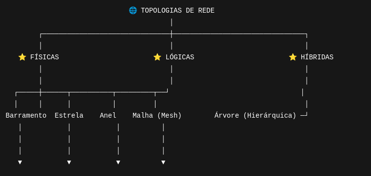
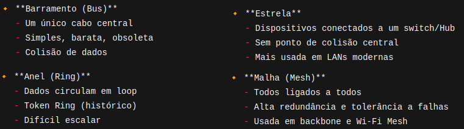
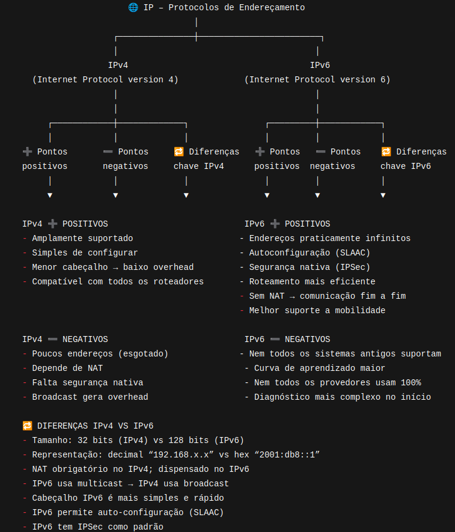
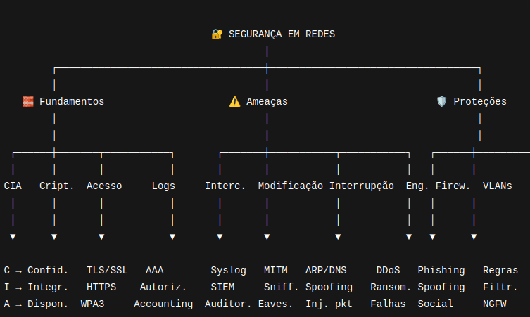
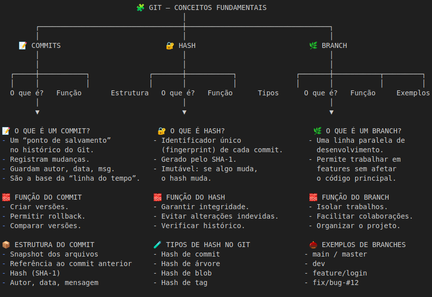

# 📚 O que aprendemos até qui?
**Disciplina:** Redes  
**Professor:** Kenji Taniguchi  
---

## 🎯 Objetivos da Aula
**Adquirir conhecimentos em topologia, escalabilidade, IPv4, IPv6 e segurança nas redes.**

---

## 📘 Introdução

**Rede de computadores é um conjunto de dispositivos interconectados que trocam informações entre si através de algum meio de comunicação.**

---

🔸 **Árvore (Tree / Hierárquica)**
   - Estrutura hierárquica (Core → Distribuição → Acesso)
   - Base moderna das redes corporativas  
   - Escalável e organizada

---

> <h2>🌐📈 Escalabilidade: </h2>

**Escalabilidade é a capacidade de um sistema de aumentar sua capacidade de trabalho sem perder o desempenho, estabilidade, confiabilidade e eficiência. Um sistema escalável consegue crescer quando preciso, reduzir custos quando o tráfego está baixo,  manter performance estável e operar com menor risco de falhas.**

🔸 **Métodos utilizados**
- Escalabilidade Vertical: Aumentando a capacidade da maquina.
- Escalabilidade Horizontal: Adicionando novos servidores ao sistema.

---

---

<h2>🌐🔐 Segurança em Redes: </h2>

**É o conjunto de técnicas, tecnologias, políticas e práticas usadas para proteger dados, dispositivos, serviços, e a infraestrutura de rede contra acessos não autorizados, ataques falhas, espionagem, perda de integridade e indisponibilidade. Baseando-se sempre no modelo CIA.**

---

**Disciplina:** Git  
**Professor:** Felipe Ozias  
**Mentor:** Mori  
---  
## 🎯 Objetivos da Aula
**Entender o uso do Git.**

---
## 📘 Introdução

**Git é um sistema de controle de versão distribuído, criado por Linus Torvalds em 2005. É utilizado para registar, controlar e gerenciar alterações em arquivos, especialmente código-fonte. O git trabalha com commits, estes contem o estado do arquivo naquele momento, um hash que é um identificador único do commit. Os commits incluem também nome do seu autor e a data de envio..**

---
  

